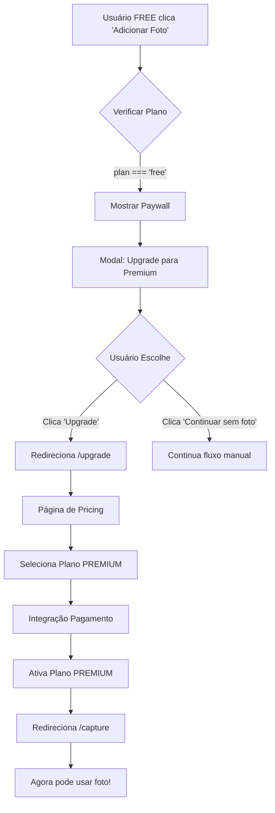
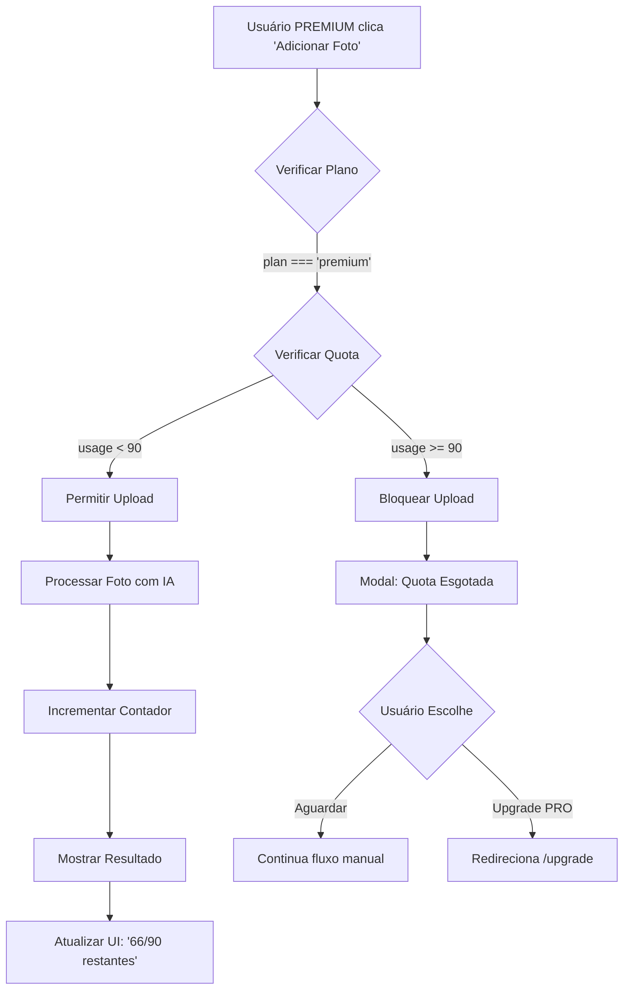
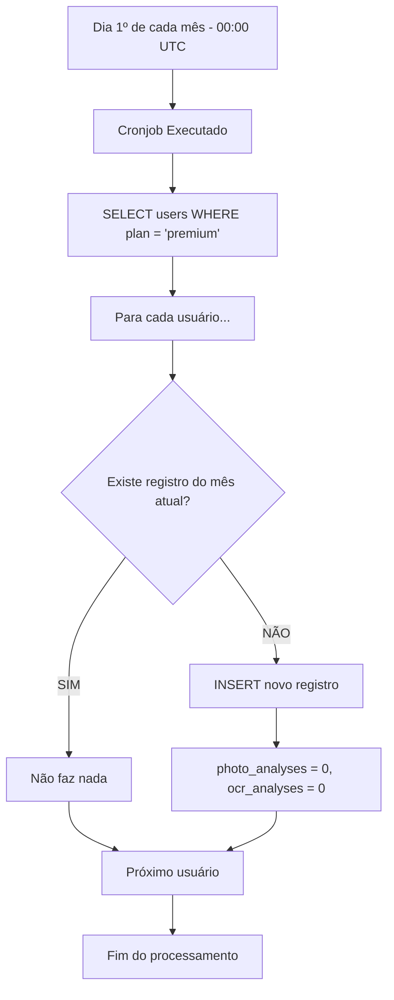

# 💎 Plano de Implementação: Sistema de Assinaturas e Quotas

**Data:** 2025-10-25
**Status:** 🟢 Fase 1 CONCLUÍDA - Infraestrutura Implementada e Testada
**Versão:** 1.1
**Última Atualização:** 2025-10-25 23:00

---

## ✅ STATUS DA IMPLEMENTAÇÃO

### Fase 1: Infraestrutura ✅ COMPLETA (2025-10-25)

**Implementado:**
- ✅ Migration 014: Campos de assinatura em `users`
- ✅ Migration 015: Tabela `usage_quotas`
- ✅ Types TypeScript (`lib/types/subscription.ts`)
- ✅ Constantes de limites (`lib/constants.ts`)
- ✅ Funções de quota (`lib/quota.ts`)
- ✅ Script de testes (`scripts/test-subscriptions.ts`)
- ✅ Migrations aplicadas manualmente no Supabase Dashboard
- ✅ Todos os testes passaram com sucesso

**Validação:**
```
✅ FREE corretamente bloqueado de usar fotos (0/0)
✅ PREMIUM tem acesso com quota de 90/mês
✅ Incremento de quota funcionando (0→1, restante 90→89)
✅ Estatísticas: Fotos 1/90 (1%), Tabelas 0/30 (0%)
✅ Reset programado para: 2025-11-01
✅ Limpeza de dados de teste OK
```

**Próxima Fase:**
- ⏸️ Fase 2: Paywalls nos Endpoints (aguardando continuação)

---

## 📋 Índice

1. [Visão Geral](#visão-geral)
2. [Análise de Custos](#análise-de-custos)
3. [Estrutura de Planos](#estrutura-de-planos)
4. [Arquitetura Multi-Tenancy](#arquitetura-multi-tenancy)
5. [Estrutura de Dados](#estrutura-de-dados)
6. [Fluxos de Usuário](#fluxos-de-usuário)
7. [Implementação Técnica](#implementação-técnica)
8. [Fases de Implementação](#fases-de-implementação)
9. [Testes e Validação](#testes-e-validação)
10. [Próximos Passos](#próximos-passos)

---

## 🎯 Visão Geral

### Objetivo

Implementar um sistema de assinaturas com **2 planos** (FREE e PREMIUM) que:

- ✅ **Garanta viabilidade financeira** do produto (custo IA controlado)
- ✅ **Ofereça valor claro** para conversão FREE → PREMIUM
- ✅ **Respeite a arquitetura multi-tenancy** existente
- ✅ **Proteja contra abuso** de recursos pagos (quotas)
- ✅ **Facilite futuras expansões** (plano PRO, features novas)

### Decisões Principais

| Item | Decisão | Justificativa |
|------|---------|---------------|
| **Nível de plano** | User-level (não tenant-level) | Cada usuário pode ter plano diferente |
| **Planos iniciais** | FREE + PREMIUM | Simplifica MVP, facilita validação |
| **FREE sem IA visual** | Sim | Reduz custo operacional em 83x |
| **Quotas no PREMIUM** | Sim (90 fotos, 30 tabelas/mês) | Protege contra abuso malicioso |
| **Pagamento inicial** | Mock (ativação manual) | Valida produto antes de integração |

---

## 💰 Análise de Custos

### Custo por Operação (Gemini 2.0 Flash)

| Operação | Custo Estimado | Frequência Esperada |
|----------|----------------|---------------------|
| Análise de texto (alimentos) | $0.0003 | 4-6x/dia (refeições) |
| Análise de foto (refeição) | $0.003 | 3x/dia (PREMIUM) |
| OCR de tabela nutricional | $0.005 | 1x/dia (PREMIUM) |
| Coach IA (texto) | $0.0005 | 1x/dia (PREMIUM) |

### Projeção Mensal por Usuário

#### Usuário FREE (150 refeições/mês)
```
150 análises texto × $0.0003 = $0.045/mês
Receita: $0
Margem: -$0.045 ✅ SUSTENTÁVEL
```

#### Usuário PREMIUM (90 fotos + 30 tabelas + 150 textos + 30 coach)
```
Custo IA:
  90 fotos     × $0.003  = $0.27
  30 tabelas   × $0.005  = $0.15
  150 textos   × $0.0003 = $0.045
  30 coach     × $0.0005 = $0.015
  TOTAL                  = $0.48/mês (~R$ 2.40)

Receita: R$ 14.90/mês
Margem: R$ 12.50 (84%) ✅ EXCELENTE
```

#### Cenário de 1000 usuários (700 FREE + 300 PREMIUM)
```
Custo IA total:
  700 FREE    × R$ 0.23  = R$ 161
  300 PREMIUM × R$ 2.40  = R$ 720
  TOTAL                  = R$ 881/mês

Receita PREMIUM: 300 × R$ 14.90 = R$ 4.470/mês
Margem bruta: R$ 3.589/mês (80%) ✅
```

---

## 📊 Estrutura de Planos

### FREE (Custo Zero para o Negócio)

```yaml
Recursos Incluídos:
  ✅ Registro de refeições (manual)
  ✅ Banco de alimentos ilimitado
  ✅ Busca inteligente de alimentos
  ✅ IA para refinar valores nutricionais (texto only)
  ✅ Dashboard básico (gráficos de calorias/macros)
  ✅ Histórico de 30 dias
  ✅ Registro de água e evacuações
  ✅ Registro de peso

Recursos Bloqueados:
  ❌ Análise de foto de refeições (0/mês)
  ❌ OCR de tabelas nutricionais (0/mês)
  ❌ Coach IA personalizado
  ❌ Relatórios avançados
  ❌ Exportação de dados
  ❌ Histórico > 30 dias

Objetivo do FREE:
  - Demonstrar valor do produto
  - Capturar base de usuários
  - Identificar power users para conversão
```

### PREMIUM (R$ 14,90/mês ou R$ 119/ano)

```yaml
Recursos Incluídos:
  ✅ TUDO do FREE +

  Recursos IA Visual:
    📸 Análise de foto de refeições: 90/mês (3/dia)
    📋 OCR de tabelas nutricionais: 30/mês (1/dia)

  Coach IA:
    🤖 Análise semanal de progresso
    💬 Feedback diário personalizado
    🎯 Ajuste automático de metas
    ⚠️ Alertas nutricionais
    🏆 Celebração de conquistas

  Relatórios:
    📊 Tendências de longo prazo
    📈 Análise de padrões alimentares
    📉 Comparativos mensais
    📥 Exportação CSV/PDF

  Outros:
    📜 Histórico ilimitado
    💎 Suporte prioritário
    🔔 Notificações inteligentes

Quotas Mensais (proteção contra abuso):
  - 90 análises de foto/mês
  - 30 análises de tabela/mês
  - Reset automático todo dia 1º

Conversão Esperada:
  - 10-15% dos usuários FREE
  - Power users (>10 refeições/semana)
  - Usuários com objetivos claros (emagrecer, ganhar massa)
```

---

## 🏗️ Arquitetura Multi-Tenancy

### Decisão: User-Level Plans (não Tenant-Level)

**Estrutura Atual:**
```
Tenant (empresa/família)
  ├─ User 1 (owner)
  ├─ User 2 (admin)
  └─ User 3 (member)
```

**Estrutura Proposta:**
```
Tenant (empresa/família)
  ├─ User 1 (owner)   → PREMIUM
  ├─ User 2 (admin)   → FREE
  └─ User 3 (member)  → FREE
```

### Por que User-Level?

| Aspecto | Tenant-Level | User-Level | Escolha |
|---------|--------------|------------|---------|
| **Caso de uso principal** | Empresas/equipes | Indivíduos/famílias | ✅ User-Level |
| **Flexibilidade** | Todos mesma quota | Cada um paga seu plano | ✅ User-Level |
| **Simplicidade cobrança** | 1 cobrança/tenant | 1 cobrança/user | ✅ User-Level |
| **Conversão** | Difícil (barreira alta) | Fácil (individual) | ✅ User-Level |
| **Modelo de negócio** | B2B | B2C | ✅ User-Level (B2C) |

### Implicações Técnicas

```typescript
// Cada operação verifica o plano do USER, não do TENANT
async function checkPhotoQuota(userId: string): Promise<boolean> {
  const user = await getUserById(userId);

  if (user.plan === 'free') {
    return false; // FREE não tem direito a fotos
  }

  if (user.plan === 'premium') {
    const usage = await getMonthlyUsage(userId, 'photo');
    return usage < 90; // Verifica quota individual
  }
}
```

**Benefícios:**
- ✅ Usuário paga só por si mesmo
- ✅ Conversão mais fácil (ticket baixo)
- ✅ Escalabilidade linear
- ✅ Simplicidade de implementação

**Desvantagens:**
- ❌ Mais cobranças para gerenciar (se 1 tenant tiver 10 users PREMIUM)
- ⚠️ Solução futura: "Family Plan" (desconto para múltiplos usuários mesmo tenant)

---

## 🗄️ Estrutura de Dados

### Migration 1: Adicionar Campos de Plano em Users

```sql
-- File: migrations/014_add_subscription_plan.sql

-- Adiciona campos de assinatura na tabela users
ALTER TABLE users
  ADD COLUMN IF NOT EXISTS plan VARCHAR(20) NOT NULL DEFAULT 'free'
    CHECK (plan IN ('free', 'premium')),
  ADD COLUMN IF NOT EXISTS subscription_status VARCHAR(20) NOT NULL DEFAULT 'active'
    CHECK (subscription_status IN ('active', 'canceled', 'expired', 'trial')),
  ADD COLUMN IF NOT EXISTS subscription_started_at TIMESTAMP,
  ADD COLUMN IF NOT EXISTS subscription_expires_at TIMESTAMP,
  ADD COLUMN IF NOT EXISTS stripe_customer_id VARCHAR(100),
  ADD COLUMN IF NOT EXISTS stripe_subscription_id VARCHAR(100);

-- Índices para performance
CREATE INDEX IF NOT EXISTS idx_users_plan ON users(plan);
CREATE INDEX IF NOT EXISTS idx_users_subscription_expires ON users(subscription_expires_at);
CREATE INDEX IF NOT EXISTS idx_users_stripe_customer ON users(stripe_customer_id);

-- Comentários
COMMENT ON COLUMN users.plan IS 'Plano do usuário: free ou premium';
COMMENT ON COLUMN users.subscription_status IS 'Status da assinatura';
COMMENT ON COLUMN users.subscription_expires_at IS 'Data de expiração (null = ilimitado para free)';
COMMENT ON COLUMN users.stripe_customer_id IS 'ID do cliente no Stripe (futuro)';
COMMENT ON COLUMN users.stripe_subscription_id IS 'ID da assinatura no Stripe (futuro)';
```

### Migration 2: Criar Tabela de Quotas

```sql
-- File: migrations/015_create_usage_quotas.sql

-- Tabela para rastrear uso mensal de recursos premium
CREATE TABLE IF NOT EXISTS usage_quotas (
  id UUID PRIMARY KEY DEFAULT uuid_generate_v4(),
  user_id UUID NOT NULL REFERENCES users(id) ON DELETE CASCADE,
  tenant_id UUID NOT NULL REFERENCES tenants(id) ON DELETE CASCADE,
  month VARCHAR(7) NOT NULL, -- Formato: '2025-10'

  -- Contadores de uso
  photo_analyses INTEGER NOT NULL DEFAULT 0,
  ocr_analyses INTEGER NOT NULL DEFAULT 0,

  -- Metadados
  created_at TIMESTAMP NOT NULL DEFAULT NOW(),
  updated_at TIMESTAMP NOT NULL DEFAULT NOW(),

  -- Garante 1 registro por usuário por mês
  UNIQUE (user_id, month)
);

-- Índices para performance
CREATE INDEX IF NOT EXISTS idx_usage_quotas_user_month ON usage_quotas(user_id, month);
CREATE INDEX IF NOT EXISTS idx_usage_quotas_tenant ON usage_quotas(tenant_id);
CREATE INDEX IF NOT EXISTS idx_usage_quotas_month ON usage_quotas(month);

-- Comentários
COMMENT ON TABLE usage_quotas IS 'Rastreamento de uso mensal de recursos premium por usuário';
COMMENT ON COLUMN usage_quotas.month IS 'Mês de referência no formato YYYY-MM';
COMMENT ON COLUMN usage_quotas.photo_analyses IS 'Quantidade de análises de foto usadas no mês';
COMMENT ON COLUMN usage_quotas.ocr_analyses IS 'Quantidade de análises de tabela usadas no mês';
```

### Schema TypeScript

```typescript
// lib/types/subscription.ts

export type Plan = 'free' | 'premium';

export type SubscriptionStatus = 'active' | 'canceled' | 'expired' | 'trial';

export interface UserWithPlan {
  id: string;
  email: string;
  name: string;
  tenant_id: string;
  plan: Plan;
  subscription_status: SubscriptionStatus;
  subscription_started_at: Date | null;
  subscription_expires_at: Date | null;
  stripe_customer_id: string | null;
  stripe_subscription_id: string | null;
  created_at: Date;
  updated_at: Date;
}

export interface UsageQuota {
  id: string;
  user_id: string;
  tenant_id: string;
  month: string; // 'YYYY-MM'
  photo_analyses: number;
  ocr_analyses: number;
  created_at: Date;
  updated_at: Date;
}

export interface QuotaLimits {
  photo_analyses_per_month: number;
  ocr_analyses_per_month: number;
  history_days: number | null; // null = ilimitado
}
```

---

## 🔄 Fluxos de Usuário

### Fluxo 1: Usuário FREE Tenta Usar Recurso Premium



### Fluxo 2: Usuário PREMIUM Usa Quota



### Fluxo 3: Reset Mensal de Quotas (Cronjob)



---

## ⚙️ Implementação Técnica

### 1. Constantes de Limites

```typescript
// lib/constants.ts

export const PLAN_LIMITS = {
  free: {
    photo_analyses_per_month: 0,
    ocr_analyses_per_month: 0,
    history_days: 30,
    coach_ai: false,
    advanced_reports: false,
    data_export: false,
  },
  premium: {
    photo_analyses_per_month: 90,
    ocr_analyses_per_month: 30,
    history_days: null, // ilimitado
    coach_ai: true,
    advanced_reports: true,
    data_export: true,
  },
} as const;

export const QUOTA_TYPES = {
  PHOTO: 'photo_analyses',
  OCR: 'ocr_analyses',
} as const;
```

### 2. Funções de Quota

```typescript
// lib/quota.ts

import { getPool } from './db';
import { PLAN_LIMITS, QUOTA_TYPES } from './constants';
import type { Plan, UsageQuota } from './types/subscription';

/**
 * Obtém o mês atual no formato YYYY-MM
 */
function getCurrentMonth(): string {
  const now = new Date();
  const year = now.getFullYear();
  const month = String(now.getMonth() + 1).padStart(2, '0');
  return `${year}-${month}`;
}

/**
 * Busca ou cria registro de quota para o mês atual
 */
async function getOrCreateQuota(
  userId: string,
  tenantId: string,
  month: string = getCurrentMonth()
): Promise<UsageQuota> {
  const pool = getPool();

  // Tenta buscar registro existente
  const { rows } = await pool.query<UsageQuota>(
    `SELECT * FROM usage_quotas
     WHERE user_id = $1 AND month = $2
     LIMIT 1`,
    [userId, month]
  );

  if (rows.length > 0) {
    return rows[0];
  }

  // Cria novo registro
  const { rows: newRows } = await pool.query<UsageQuota>(
    `INSERT INTO usage_quotas (user_id, tenant_id, month)
     VALUES ($1, $2, $3)
     RETURNING *`,
    [userId, tenantId, month]
  );

  return newRows[0];
}

/**
 * Verifica se o usuário pode usar um recurso
 */
export async function checkQuota(
  userId: string,
  tenantId: string,
  plan: Plan,
  quotaType: 'photo' | 'ocr'
): Promise<{
  allowed: boolean;
  used: number;
  limit: number;
  remaining: number;
}> {
  // FREE não tem acesso a recursos visuais
  if (plan === 'free') {
    return {
      allowed: false,
      used: 0,
      limit: 0,
      remaining: 0,
    };
  }

  // PREMIUM: verifica quota
  const limits = PLAN_LIMITS[plan];
  const limit =
    quotaType === 'photo'
      ? limits.photo_analyses_per_month
      : limits.ocr_analyses_per_month;

  const quota = await getOrCreateQuota(userId, tenantId);
  const used =
    quotaType === 'photo' ? quota.photo_analyses : quota.ocr_analyses;

  return {
    allowed: used < limit,
    used,
    limit,
    remaining: Math.max(0, limit - used),
  };
}

/**
 * Incrementa o contador de uso
 */
export async function incrementQuota(
  userId: string,
  tenantId: string,
  quotaType: 'photo' | 'ocr'
): Promise<void> {
  const pool = getPool();
  const month = getCurrentMonth();
  const field = quotaType === 'photo' ? 'photo_analyses' : 'ocr_analyses';

  // Garante que o registro existe
  await getOrCreateQuota(userId, tenantId, month);

  // Incrementa contador
  await pool.query(
    `UPDATE usage_quotas
     SET ${field} = ${field} + 1,
         updated_at = NOW()
     WHERE user_id = $1 AND month = $2`,
    [userId, month]
  );
}

/**
 * Busca estatísticas de uso para exibir ao usuário
 */
export async function getUsageStats(
  userId: string,
  tenantId: string,
  plan: Plan
): Promise<{
  photoAnalyses: { used: number; limit: number; percentage: number };
  ocrAnalyses: { used: number; limit: number; percentage: number };
  resetDate: Date;
}> {
  const quota = await getOrCreateQuota(userId, tenantId);
  const limits = PLAN_LIMITS[plan];

  const photoLimit = limits.photo_analyses_per_month;
  const ocrLimit = limits.ocr_analyses_per_month;

  // Calcula data do próximo reset (dia 1º do próximo mês)
  const now = new Date();
  const nextMonth = new Date(now.getFullYear(), now.getMonth() + 1, 1);

  return {
    photoAnalyses: {
      used: quota.photo_analyses,
      limit: photoLimit,
      percentage: Math.round((quota.photo_analyses / photoLimit) * 100),
    },
    ocrAnalyses: {
      used: quota.ocr_analyses,
      limit: ocrLimit,
      percentage: Math.round((quota.ocr_analyses / ocrLimit) * 100),
    },
    resetDate: nextMonth,
  };
}
```

### 3. Middleware de Verificação

```typescript
// lib/middleware/check-plan.ts

import { auth } from '../../auth';
import { isAppSession } from '../types/auth';
import { getPool } from '../db';
import type { Plan } from '../types/subscription';

export async function requirePlan(
  allowedPlans: Plan[]
): Promise<{ userId: string; tenantId: string; plan: Plan }> {
  const session = await auth();

  if (!isAppSession(session)) {
    throw new Response(
      JSON.stringify({ error: 'unauthorized' }),
      { status: 401 }
    );
  }

  const pool = getPool();
  const { rows } = await pool.query(
    'SELECT plan FROM users WHERE id = $1 LIMIT 1',
    [session.userId]
  );

  if (rows.length === 0) {
    throw new Response(
      JSON.stringify({ error: 'user_not_found' }),
      { status: 404 }
    );
  }

  const userPlan = rows[0].plan as Plan;

  if (!allowedPlans.includes(userPlan)) {
    throw new Response(
      JSON.stringify({
        error: 'upgrade_required',
        message: `Este recurso requer plano: ${allowedPlans.join(' ou ')}`,
        currentPlan: userPlan,
        requiredPlans: allowedPlans,
      }),
      { status: 403 }
    );
  }

  return {
    userId: session.userId,
    tenantId: session.tenantId,
    plan: userPlan,
  };
}
```

### 4. Exemplo de Uso em Endpoint

```typescript
// app/api/meals/analyze-meal/route.ts (MODIFICADO)

import { NextRequest } from 'next/server';
import { requirePlan } from '@/lib/middleware/check-plan';
import { checkQuota, incrementQuota } from '@/lib/quota';
import { analyzeFood } from '@/lib/ai';

export async function POST(req: NextRequest) {
  try {
    // Verifica autenticação
    const { userId, tenantId, plan } = await requirePlan(['free', 'premium']);

    const contentType = req.headers.get('content-type') || '';
    let image: File | null = null;
    let payload: any;

    // Extrai dados da requisição
    if (contentType.includes('multipart/form-data')) {
      const formData = await req.formData();
      image = formData.get('image') as File;
      const dataStr = formData.get('data') as string;
      payload = JSON.parse(dataStr);
    } else {
      payload = await req.json();
    }

    // VERIFICAÇÃO DE QUOTA: Se tem foto, verifica permissão
    if (image) {
      if (plan === 'free') {
        return Response.json(
          {
            error: 'upgrade_required',
            message: 'Análise de foto é um recurso PREMIUM',
            feature: 'photo_analysis',
          },
          { status: 403 }
        );
      }

      // Verifica quota do PREMIUM
      const quota = await checkQuota(userId, tenantId, plan, 'photo');

      if (!quota.allowed) {
        return Response.json(
          {
            error: 'quota_exceeded',
            message: `Você atingiu o limite de ${quota.limit} análises de foto este mês`,
            used: quota.used,
            limit: quota.limit,
            resetDate: new Date(
              new Date().getFullYear(),
              new Date().getMonth() + 1,
              1
            ).toISOString(),
          },
          { status: 429 }
        );
      }
    }

    // Processa com IA
    let imageBase64: string | undefined;
    if (image) {
      const bytes = await image.arrayBuffer();
      const buffer = Buffer.from(bytes);
      imageBase64 = `data:${image.type};base64,${buffer.toString('base64')}`;
    }

    const description = payload.foods
      .map((f: any) => `${f.quantity} ${f.unit} de ${f.name}`)
      .join(', ');

    const result = await analyzeFood(description, imageBase64);

    // INCREMENTA QUOTA se usou foto
    if (image && plan === 'premium') {
      await incrementQuota(userId, tenantId, 'photo');
    }

    return Response.json({ result });
  } catch (error: any) {
    console.error('Error analyzing meal:', error);
    return Response.json(
      { error: error.message || 'internal_error' },
      { status: error.status || 500 }
    );
  }
}
```

### 5. Componente de Paywall

```typescript
// components/Paywall.tsx

'use client';

import { useRouter } from 'next/navigation';

interface PaywallProps {
  feature: 'photo_analysis' | 'ocr_analysis' | 'coach_ai' | 'advanced_reports';
  title?: string;
  description?: string;
}

const FEATURE_INFO = {
  photo_analysis: {
    icon: '📸',
    title: 'Análise de Foto com IA',
    description: 'Tire foto da sua refeição e deixe a IA identificar todos os alimentos automaticamente',
  },
  ocr_analysis: {
    icon: '📋',
    title: 'Escaneamento de Tabelas Nutricionais',
    description: 'Tire foto de rótulos e extraia os valores nutricionais automaticamente',
  },
  coach_ai: {
    icon: '🤖',
    title: 'Coach IA Personalizado',
    description: 'Receba análises semanais, feedback diário e sugestões personalizadas',
  },
  advanced_reports: {
    icon: '📊',
    title: 'Relatórios Avançados',
    description: 'Visualize tendências, padrões e compare períodos com gráficos detalhados',
  },
};

export default function Paywall({ feature, title, description }: PaywallProps) {
  const router = useRouter();
  const info = FEATURE_INFO[feature];

  return (
    <div
      style={{
        background: 'linear-gradient(135deg, #667eea 0%, #764ba2 100%)',
        borderRadius: 16,
        padding: 32,
        color: 'white',
        textAlign: 'center',
        margin: '24px 0',
      }}
    >
      <div style={{ fontSize: 64, marginBottom: 16 }}>{info.icon}</div>
      <h2 style={{ fontSize: 24, fontWeight: 700, marginBottom: 12 }}>
        {title || info.title}
      </h2>
      <p style={{ fontSize: 16, opacity: 0.9, marginBottom: 24, maxWidth: 400, margin: '0 auto 24px' }}>
        {description || info.description}
      </p>

      <div
        style={{
          background: 'rgba(255, 255, 255, 0.2)',
          borderRadius: 12,
          padding: 20,
          marginBottom: 24,
        }}
      >
        <div style={{ fontSize: 14, opacity: 0.8, marginBottom: 8 }}>
          Recurso disponível no plano
        </div>
        <div style={{ fontSize: 32, fontWeight: 700 }}>💎 PREMIUM</div>
        <div style={{ fontSize: 18, marginTop: 8 }}>R$ 14,90/mês</div>
      </div>

      <button
        onClick={() => router.push('/upgrade')}
        style={{
          background: 'white',
          color: '#667eea',
          border: 'none',
          borderRadius: 12,
          padding: '16px 32px',
          fontSize: 18,
          fontWeight: 700,
          cursor: 'pointer',
          marginRight: 12,
        }}
      >
        ⬆️ Fazer Upgrade
      </button>

      <button
        onClick={() => router.back()}
        style={{
          background: 'transparent',
          color: 'white',
          border: '2px solid white',
          borderRadius: 12,
          padding: '16px 32px',
          fontSize: 16,
          fontWeight: 600,
          cursor: 'pointer',
        }}
      >
        Voltar
      </button>
    </div>
  );
}
```

### 6. Card de Quota no Dashboard

```typescript
// components/QuotaCard.tsx

'use client';

import { useEffect, useState } from 'react';

interface QuotaData {
  photoAnalyses: { used: number; limit: number; percentage: number };
  ocrAnalyses: { used: number; limit: number; percentage: number };
  resetDate: string;
}

export default function QuotaCard() {
  const [quota, setQuota] = useState<QuotaData | null>(null);
  const [loading, setLoading] = useState(true);

  useEffect(() => {
    fetch('/api/user/quota', { credentials: 'include' })
      .then((res) => res.json())
      .then((data) => {
        setQuota(data);
        setLoading(false);
      })
      .catch(() => setLoading(false));
  }, []);

  if (loading) {
    return <div>Carregando quotas...</div>;
  }

  if (!quota) return null;

  const daysUntilReset = Math.ceil(
    (new Date(quota.resetDate).getTime() - Date.now()) / (1000 * 60 * 60 * 24)
  );

  return (
    <div
      style={{
        background: 'white',
        border: '2px solid #e5e7eb',
        borderRadius: 16,
        padding: 24,
        marginBottom: 24,
      }}
    >
      <h3 style={{ fontSize: 18, fontWeight: 700, marginBottom: 16 }}>
        📊 Uso de Recursos Premium
      </h3>

      {/* Análises de Foto */}
      <div style={{ marginBottom: 16 }}>
        <div
          style={{
            display: 'flex',
            justifyContent: 'space-between',
            marginBottom: 8,
          }}
        >
          <span style={{ fontSize: 14, fontWeight: 600 }}>📸 Análises de Foto</span>
          <span style={{ fontSize: 14, color: '#6b7280' }}>
            {quota.photoAnalyses.used}/{quota.photoAnalyses.limit}
          </span>
        </div>
        <div
          style={{
            background: '#f3f4f6',
            borderRadius: 8,
            height: 8,
            overflow: 'hidden',
          }}
        >
          <div
            style={{
              background:
                quota.photoAnalyses.percentage >= 80
                  ? '#ef4444'
                  : quota.photoAnalyses.percentage >= 50
                  ? '#f59e0b'
                  : '#10b981',
              height: '100%',
              width: `${quota.photoAnalyses.percentage}%`,
              transition: 'width 0.3s',
            }}
          />
        </div>
      </div>

      {/* Análises de Tabela */}
      <div style={{ marginBottom: 16 }}>
        <div
          style={{
            display: 'flex',
            justifyContent: 'space-between',
            marginBottom: 8,
          }}
        >
          <span style={{ fontSize: 14, fontWeight: 600 }}>📋 Tabelas Nutricionais</span>
          <span style={{ fontSize: 14, color: '#6b7280' }}>
            {quota.ocrAnalyses.used}/{quota.ocrAnalyses.limit}
          </span>
        </div>
        <div
          style={{
            background: '#f3f4f6',
            borderRadius: 8,
            height: 8,
            overflow: 'hidden',
          }}
        >
          <div
            style={{
              background:
                quota.ocrAnalyses.percentage >= 80
                  ? '#ef4444'
                  : quota.ocrAnalyses.percentage >= 50
                  ? '#f59e0b'
                  : '#10b981',
              height: '100%',
              width: `${quota.ocrAnalyses.percentage}%`,
              transition: 'width 0.3s',
            }}
          />
        </div>
      </div>

      <div
        style={{
          fontSize: 12,
          color: '#6b7280',
          textAlign: 'center',
          paddingTop: 12,
          borderTop: '1px solid #e5e7eb',
        }}
      >
        ⏰ Reseta em {daysUntilReset} {daysUntilReset === 1 ? 'dia' : 'dias'}
      </div>
    </div>
  );
}
```

---

## 📅 Fases de Implementação

### Fase 1: Infraestrutura (1-2 dias)

**Objetivo:** Criar base de dados e funções core

- [ ] **1.1** Criar migration `014_add_subscription_plan.sql`
- [ ] **1.2** Criar migration `015_create_usage_quotas.sql`
- [ ] **1.3** Rodar migrations no banco de desenvolvimento
- [ ] **1.4** Criar types TypeScript (`lib/types/subscription.ts`)
- [ ] **1.5** Criar constantes de limites (`lib/constants.ts`)
- [ ] **1.6** Criar funções de quota (`lib/quota.ts`)
- [ ] **1.7** Criar middleware de verificação (`lib/middleware/check-plan.ts`)
- [ ] **1.8** Testar funções isoladamente

**Critério de Sucesso:**
- ✅ Migrations aplicadas sem erro
- ✅ Funções `checkQuota()` e `incrementQuota()` funcionando
- ✅ Consegue criar usuários com `plan = 'premium'` manualmente no DB

---

### Fase 2: Paywalls nos Endpoints (1 dia)

**Objetivo:** Proteger APIs de recursos premium

- [ ] **2.1** Modificar `/api/meals/analyze-meal` (verificar foto)
- [ ] **2.2** Modificar `/api/meals/analyze-image` (verificar quota)
- [ ] **2.3** Modificar endpoint de OCR de tabelas (meus-alimentos)
- [ ] **2.4** Criar endpoint `/api/user/quota` (retornar estatísticas)
- [ ] **2.5** Testar todos endpoints com usuário FREE
- [ ] **2.6** Testar todos endpoints com usuário PREMIUM (dentro da quota)
- [ ] **2.7** Testar comportamento quando quota esgota

**Critério de Sucesso:**
- ✅ Usuário FREE recebe erro 403 ao tentar usar foto
- ✅ Usuário PREMIUM consegue usar até a quota
- ✅ Usuário PREMIUM recebe erro 429 após quota esgotada
- ✅ Contadores incrementam corretamente

---

### Fase 3: UI e UX (2 dias)

**Objetivo:** Criar interfaces de paywall e quota

- [ ] **3.1** Criar componente `Paywall.tsx` reutilizável
- [ ] **3.2** Criar componente `QuotaCard.tsx`
- [ ] **3.3** Modificar `/capture/page.tsx`:
  - Esconder campo de foto se FREE
  - Mostrar paywall ao clicar
  - Mostrar quota restante se PREMIUM
- [ ] **3.4** Modificar `/meus-alimentos/page.tsx`:
  - Esconder botão OCR se FREE
  - Mostrar paywall ao clicar
- [ ] **3.5** Adicionar `QuotaCard` no dashboard
- [ ] **3.6** Testar toda jornada de usuário FREE
- [ ] **3.7** Testar toda jornada de usuário PREMIUM

**Critério de Sucesso:**
- ✅ Usuário FREE vê paywalls ao invés de features premium
- ✅ Usuário PREMIUM vê contadores de quota
- ✅ Transições visuais estão fluidas
- ✅ Mensagens de erro são claras

---

### Fase 4: Página de Upgrade (1 dia)

**Objetivo:** Criar página de pricing e upgrade

- [ ] **4.1** Criar página `/upgrade/page.tsx`
- [ ] **4.2** Criar tabela comparativa FREE vs PREMIUM
- [ ] **4.3** Adicionar FAQ sobre planos
- [ ] **4.4** Adicionar botão "Ativar PREMIUM" (mock por enquanto)
- [ ] **4.5** Criar script de ativação manual no admin
- [ ] **4.6** Documentar processo de ativação manual

**Critério de Sucesso:**
- ✅ Página de pricing está clara e convincente
- ✅ Consegue ativar PREMIUM manualmente via DB
- ✅ Após ativação, usuário tem acesso a features

---

### Fase 5: Coach IA (2-3 dias) - OPCIONAL PARA MVP

**Objetivo:** Implementar coach IA personalizado

- [ ] **5.1** Criar função `analyzeWeeklyProgress()` na `lib/ai.ts`
- [ ] **5.2** Criar endpoint `/api/coach/daily-feedback`
- [ ] **5.3** Criar endpoint `/api/coach/weekly-analysis`
- [ ] **5.4** Criar página ou seção `/coach`
- [ ] **5.5** Adicionar notificações de coach

**Critério de Sucesso:**
- ✅ Coach gera análises relevantes
- ✅ Feedback é personalizado ao histórico do usuário
- ✅ Não gera custo excessivo de API

---

### Fase 6: Integração de Pagamento (3-5 dias) - FUTURO

**Objetivo:** Integrar Stripe/Mercado Pago

- [ ] **6.1** Criar conta no gateway escolhido
- [ ] **6.2** Configurar webhooks
- [ ] **6.3** Criar endpoints de checkout
- [ ] **6.4** Implementar atualização automática de plano
- [ ] **6.5** Implementar cancelamento
- [ ] **6.6** Testes em ambiente de homologação

**Critério de Sucesso:**
- ✅ Usuário consegue pagar via cartão/PIX
- ✅ Plano é ativado automaticamente
- ✅ Renovação automática funciona
- ✅ Cancelamento funciona

---

## 🧪 Testes e Validação

### Checklist de Testes

#### Backend

- [ ] Usuário FREE não consegue acessar endpoints de foto
- [ ] Usuário FREE não consegue acessar endpoints de OCR
- [ ] Usuário PREMIUM consegue usar foto (dentro da quota)
- [ ] Usuário PREMIUM consegue usar OCR (dentro da quota)
- [ ] Quota incrementa corretamente a cada uso
- [ ] Quota bloqueia após limite atingido
- [ ] Quota reseta corretamente no dia 1º
- [ ] Múltiplos usuários no mesmo tenant têm quotas independentes
- [ ] Erros retornam status HTTP corretos (403, 429)

#### Frontend

- [ ] Usuário FREE vê paywall ao invés de campo de foto
- [ ] Usuário FREE vê paywall ao invés de botão OCR
- [ ] Usuário PREMIUM vê contadores de quota
- [ ] Contador de quota atualiza após uso
- [ ] Avisos aparecem quando quota atinge 80%
- [ ] Bloqueio aparece quando quota esgota
- [ ] Botão "Upgrade" redireciona corretamente
- [ ] Página de pricing está funcional

#### UX

- [ ] Mensagens de erro são claras e úteis
- [ ] Paywalls são visualmente atraentes
- [ ] Valor do PREMIUM está claro
- [ ] Processo de upgrade é intuitivo
- [ ] Não há frustração excessiva no FREE

---

## 🚀 Próximos Passos

### Decisões Pendentes

1. **Gateway de Pagamento:**
   - [ ] Stripe (internacional)
   - [ ] Mercado Pago (Brasil, PIX)
   - [ ] PagSeguro
   - [ ] Outro?

2. **Preço PREMIUM:**
   - [ ] R$ 14,90/mês confirmado?
   - [ ] Plano anual com desconto? (R$ 119/ano = ~R$ 9,92/mês)

3. **Plano PRO no futuro?**
   - [ ] Sim, com 300 fotos e 100 tabelas/mês
   - [ ] Não, só FREE e PREMIUM

4. **Trial gratuito?**
   - [ ] 7 dias de PREMIUM grátis para novos usuários?
   - [ ] Não, direto para FREE

### Roadmap Futuro

**Q1 2026:**
- ✅ Implementar Fases 1-4 (MVP de assinaturas)
- ✅ Validar conversão FREE → PREMIUM
- ⏸️ Coach IA (Fase 5) se conversão > 5%

**Q2 2026:**
- Integração de pagamento (Fase 6)
- Plano PRO (se demanda justificar)
- Family Plan (desconto para múltiplos usuários mesmo tenant)

**Q3 2026:**
- Recursos premium adicionais (análise de sangue, diário de sintomas)
- API para integrações
- White-label para nutricionistas

---

## 📝 Notas Finais

### Decisões de Arquitetura

1. **Por que User-Level e não Tenant-Level?**
   - Modelo B2C mais adequado
   - Conversão individual mais fácil
   - Escalabilidade linear
   - Futuro: adicionar "Family Plan" se necessário

2. **Por que quotas no PREMIUM?**
   - Proteção contra abuso malicioso
   - Controle de custos
   - Incentivo para plano PRO no futuro

3. **Por que FREE sem IA visual?**
   - Custo operacional reduzido em 83x
   - FREE ainda é valioso (IA de texto)
   - Diferencial claro para PREMIUM

### Riscos e Mitigações

| Risco | Probabilidade | Impacto | Mitigação |
|-------|---------------|---------|-----------|
| Conversão baixa (<3%) | Média | Alto | Melhorar onboarding, mostrar valor |
| Abuso de quotas | Baixa | Médio | Quotas já implementadas |
| Custo IA sobe | Média | Alto | Monitorar, ajustar quotas se necessário |
| Churn alto | Média | Alto | Coach IA, relatórios, engajamento |

### Métricas de Sucesso

**MVP (3 meses):**
- 1000+ usuários FREE
- 5%+ conversão para PREMIUM
- Margem > 70%
- Churn < 15%/mês

**6 meses:**
- 5000+ usuários FREE
- 300+ usuários PREMIUM
- R$ 4.500/mês de receita
- LTV/CAC > 3

---

## 🔄 Como Retomar a Implementação

### Arquivos Já Criados (Fase 1):

```
migrations/
  ├─ 014_add_subscription_plan.sql      ✅ Aplicada no Supabase
  └─ 015_create_usage_quotas.sql        ✅ Aplicada no Supabase

lib/
  ├─ types/subscription.ts              ✅ Types completos
  ├─ constants.ts                       ✅ PLAN_LIMITS adicionados
  └─ quota.ts                           ✅ checkQuota, incrementQuota, getUsageStats

scripts/
  └─ test-subscriptions.ts              ✅ Testes passaram
```

### Estado do Banco de Dados:

```sql
-- Verificar estado atual:
SELECT id, email, plan, subscription_status
FROM users LIMIT 3;

-- Todos usuários estão em: plan='free', subscription_status='active'
-- Tabela usage_quotas existe e está vazia
-- Sistema pronto para uso!
```

### Para Continuar (Fase 2):

1. **Adicionar Paywalls nos Endpoints**
   - Começar com `/api/meals/analyze-meal` (foto)
   - Verificar plano antes de processar
   - Incrementar quota após sucesso

2. **Modificar UI (Fase 3)**
   - Esconder campo de foto se FREE
   - Mostrar paywalls
   - Adicionar contador de quota

3. **Criar Página de Upgrade (Fase 4)**
   - `/upgrade` com pricing
   - Mock de ativação manual

### Comandos Úteis:

```bash
# Testar sistema de quotas
npm run test:subscriptions

# Ativar PREMIUM manualmente (SQL no Supabase)
UPDATE users
SET plan = 'premium',
    subscription_status = 'active',
    subscription_started_at = NOW()
WHERE email = 'usuario@exemplo.com';

# Verificar quotas de um usuário
SELECT * FROM usage_quotas
WHERE user_id = 'uuid-do-usuario';
```

### Rollback (Se Necessário):

```sql
-- Remover campos de assinatura (CUIDADO!)
ALTER TABLE users
  DROP COLUMN IF EXISTS plan,
  DROP COLUMN IF EXISTS subscription_status,
  DROP COLUMN IF EXISTS subscription_started_at,
  DROP COLUMN IF EXISTS subscription_expires_at,
  DROP COLUMN IF EXISTS stripe_customer_id,
  DROP COLUMN IF EXISTS stripe_subscription_id;

-- Remover tabela de quotas
DROP TABLE IF EXISTS usage_quotas;
```

---

**Última atualização:** 2025-10-25 23:00
**Status:** ✅ Fase 1 concluída - Pronto para Fase 2
**Próxima revisão:** Após conclusão da Fase 2 (Paywalls)
